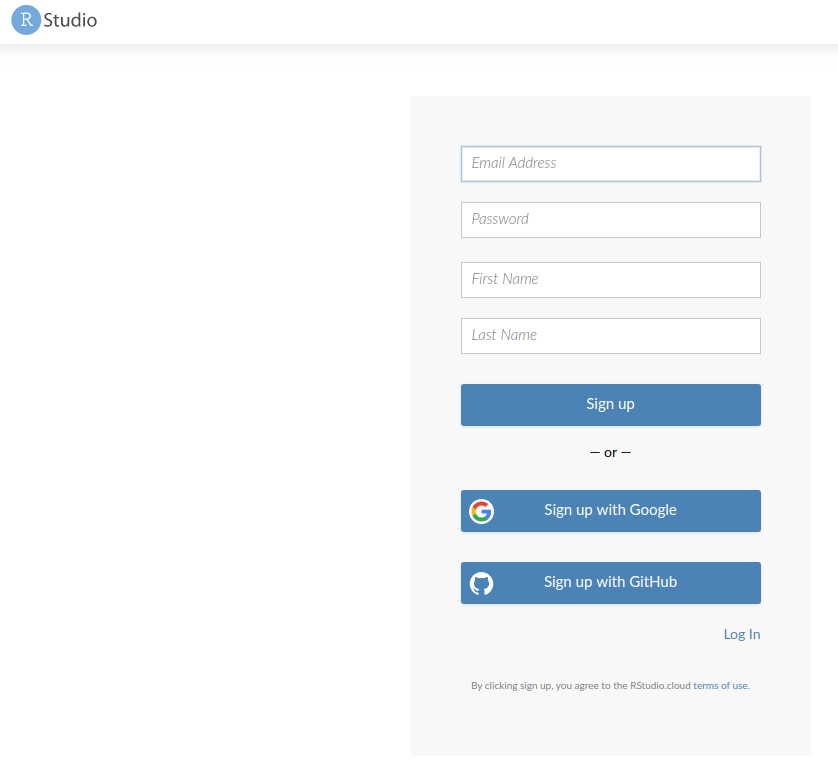

# Curso: Primeros pasos en R
A continuación encontrarás algunas indicaciones iniciales para preparar tu computador para el curso "Primeros pasos en R", organizado por Data UC. 

## Prepara tu computador

## Instalación de R y RStudio + RStudio Cloud

En este taller utilizaremos el lenguaje de programación R a través de una plataforma que facilita su uso: RStudio. RStudio es un IDE, es decir, un *Entorno de Desarrollo Integrado* (IDE es el acrónimo de *Integrated Development Environment*). Esto quiere decir que RStudio es una aplicación que nos entrega herramientas para hacer más fácil el desarrollo de proyectos usando R.

Hay dos maneras de utilizarlo: en la nube o instalar todo localmente. Ambas tienen ventajas y desventajas:

**RStudio Cloud**

- *Ventajas*: no requiere instalar nada en tu computador; solo crearte una cuenta. Como tus proyectos están en línea, puedes acceder a ellos desde cualquier computador y compartirlos con otras personas.
- *Desventaja*: requiere conexión a internet y la versión gratuita tiene un límite en la cantidad y tamaño de proyectos que puedes tener.

**RStudio en tu computador**

- *Ventajas*: no necesitas conexión a internet para trabajar (pero sí para instalar "paquetes" -ya veremos qué son los paquetes). También es más intuitivo trabajar con los archivos que están tu computador (tanto para leerlos como para crear archivos nuevos).
- *Desventajas*: implica instalar cosas. Ese proceso debería ser sencillo; sin embargo, cada computador es distinto y a veces es posible encontrarse con problemas. De todos modos, siempre es posible encontrar una solución en internet.

A continuación mostraremos el paso a paso para ambas opciones. La primera sesión trabajaremos con RStudio Cloud, para asegurarnos de que todos tienen una versión funcional andando, pero el objetivo final es que puedas tener R y RStudio instalados en tu computador para seguir trabajando de manera independiente en el futuro.  

### Preparar tu computador

Necesitarás instalar tanto R como RStudio. Para ello, sigue los siguientes pasos (¡en orden!). Si prefieres ver un video del proceso, revisa [este siguiente enlace](https://drive.google.com/drive/folders/1Olcjp3WlxmLvCLKlmCxs0SjvlqZ1i6vx).

#### 1. Instala R

Puedes descargar R desde https://cran.r-project.org/. Debes elegir la opción que corresponda, según tu sistema operativo.

Si utilizas Windows, te preguntará qué es lo que quieres instalar. Selecciona "base".

En el caso de Mac, elige la primera opción que aparece bajo "Latest release", es decir, "R-4.0.2.pkg (notarized and signed)".

Luego, sigue los pasos de instalación, tal como lo haces con cualquier programa.

Si todo sale bien, al abrir R en tu computador deberías ver algo parecido a esto en Windows:

Y en Mac se debería ver así:

(La información sobre la versión de R y sobre el sistema operativo que aparece en ese mensaje inicial puede que se vea distinto en tu caso.)

#### 2. Instala RStudio

- Una vez que R ha quedado correctamente instalado, descarga RStudio desde https://www.rstudio.com/products/rstudio/download/. Elige la primera opción, es decir, "RStudio Desktop Open Source License" (gratuita).
- Instala RStudio en tu computador, tal como lo haces con cualquier programa.

Si quedó todo bien instalado, cuando abras RStudio deberías ver algo parecido a esto (algunas cosas pueden variar según tu sistema operativo):

A lo largo del curso usaremos una versión reciente de R y RStudio, así que si tienes instalada una versión previa, puede que algunas cosas se vean un poco distintas. Versiones de R anteriores a la 3.5 harán que algunas cosas no funcionen, por lo que te sugerimos actualizar. La última versión de R es la 4.0.2 y la última de RStudio la 1.3.

**IMPORTANTE:** Si te encuentras con algún error durante este proceso, lo más probabable es que sea por alguna configuración de tu sistema operativo. En ese caso, la mejor manera de buscar una solución es copiar el error que arroja R, pegarlo en tu motor de búsqueda favorito y ver cómo alguien que se enfrentó a eso antes lo resolvió.
Si por alguna razón no logras resolver los problemas de instalación antes de la primera clase, no te preocupes. Durante esa sesión utilizaremos la versión en la nube de RStudio. A continuación explicaremos cómo registrarse.

### RStudio Cloud

#### 1. Accede a [rstudio.cloud](https://rstudio.cloud/)

#### 2. Crea una cuenta
Haz clic en "Sign up" e ingresa tus datos.

Una vez que hayas creado una cuenta, verás algo así. Este es tu espacio de trabajo.

Para poder empezar a trabajar en RStudio Cloud necesitas crear un proyecto. Para ello, haz clic en "New Project". Puede tomar alrededor de un minuto en crear:

Cuando esté listo, verás algo así:

¡Listo! Ya tienes todo lo necesario para la primera sesión.

## Prepara tu espacio de trabajo

Este es un taller práctico. En las sesiones de clases escribiremos "código en vivo", es decir, mostraremos todo el proceso de escritura del código. Lo ideal es que vayas replicando en tu computador todo lo que hagamos. Para ello, es necesario que pienses en alguna configuración de pantalla que te permita ir mirando lo que hacemos en Zoom y replicándolo en RStudio.  

A continuación hay algunas opciones:

### Una mitad de la pantalla para cada cosa

Es la opción más simple y no requieres nada más que tu computador.

### Una segunda pantalla

Esta es la opción más cómoda, pero no siempre es posible porque requieres más cosas que solo tu computador. Aquí van algunas ideas, en caso de que no tengas un segundo monitor.

#### Conectar tu computador a un televisor

Luego de conectarlo, configura tu computador para que las pantallas no se dupliquen, sino que veas dos cosas distintas en cada una. Así podrás trabajar en tu computador e ir mirando el taller en el televisor:

#### Usar otro dispositivo

Si tienes una tablet, puedes conectarte a Zoom desde ella para participar en el taller y en paralelo trabajar en tu computador. Puedes intentarlo también usando tu teléfono móvil, pero es posible que se vea demasiado pequeño el código. En todo caso, como explicaremos al inicio del taller, todo el código que vayamos escribiendo nosotras se actualizará en línea en un link que indicaremos al inicio de la sesión, por lo que si no ves bien algo en tu teléfono, puedes revisarlo ahí. Puede que esto suene un poco misterioso ahora, pero al inicio del taller lo explicaremos.

